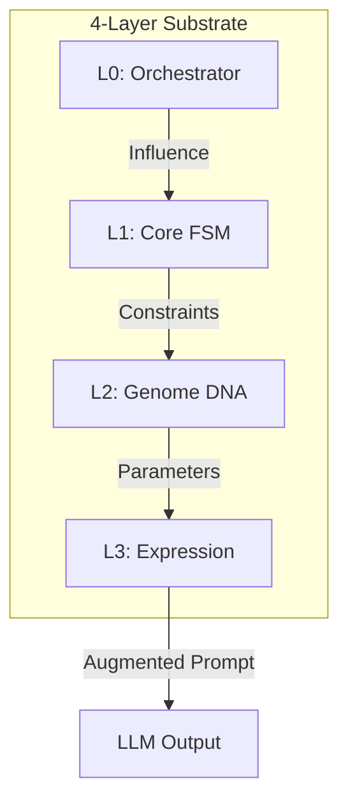

# 🧠 Persona Engine (GECCE-Substrate)


[**中文档**](./docs/README_CN.md) | [**English Guide**](./docs/HOW_TO_USE.md) | [**Architecture**](./docs/DIAGRAMS.md)

> **"Beyond static prompts: Implementing a 4-Layer Dynamic Persona Substrate for LLMs."**

---

### 🛡️ Module Charter (The "No-Go" Zone)
> **Persona Engine never decides *WHAT* to do.**
> **It only constrains *HOW* decisions are formed.**
>
> We do not simulate "consciousness" or "autonomy". We provide the **Cognitive Runtime** that ensures behavioral consistency, auditability, and distinct personality traits across sessions and models.

---

## 🎯 The Vision: Decoupling Identity from Compute

> **"Decoupling 'Who I Am' from 'Who is Computing'."**

In the traditional AI stack, `Model = Personality = Behavior`. This binds digital identity to a specific vendor's weights. The Persona Engine redefines this relationship:

```text
Model   = Reasoning Engine / Compute / Token Factory (Vendor CPU)
Persona = Behavioral Sovereignty / Values / Memory Rights (OS Profile)
```

**Models are commodities** (like cloud compute). **Personas are identities** (like user profiles). As long as the Persona configuration persists, the digital entity survives, regardless of whether the underlying model is GPT-4, Claude 3, or a local Llama instance.

**Persona Engine is the Operating System for Digital Identity.**

### Core Definition: Persona = Genotype
We explicitly define a Persona not as an "Agent" or "Bot", but as a **Digital Genotype**.
*   It is a structured, serializable information package (e.g., Protobuf/JSON).
*   It contains the **Instruction Set** for behavior, not the behavior itself.
*   The LLM acts as the **Ribosome**, translating this Genotype into Phenotypic expression (Tokens) based on environmental Context (Epigenetics).

---

## ❓ Who Needs This? (And Why Prompts Are Not Enough)

If you are building complex AI applications, you might ask: *"Why not just use a System Prompt?"*

| Feature | System Prompt | Persona Engine |
| :--- | :--- | :--- |
| **State** | Stateless (Reset every chat) | **Stateful** (Evolves & Remembers) |
| **Complexity** | Becomes "Spaghetti Text" | **Modular 4-Layer Architecture** |
| **Consistency** | Drifts with model updates | **Enforced by Kernel (GECCE)** |
| **Portability** | Locked to specific model quirks | **Model-Agnostic Genotype** |
| **Use Case** | Simple Chatbots | **Digital Companions, NPCs, Enterprise IP** |

**Use Persona Engine when you need your AI to have a consistent "Soul" that survives reboots, model swaps, and long-term interactions.**

---

## 🇨🇳 中文文档 (Chinese Documentation)
针对中文用户，我们提供了完整的中文文档库：
👉 **[点击进入中文文档中心 | Chinese Documentation Center](./docs/README_CN.md)**

---

## 🏗️ 4-Layer Architecture (GECCE-Powered)

This project is built upon the **GECCE Kernel**, a proprietary event-driven micro-kernel substrate. GECCE provides the underlying orchestration (Layer 0), while the Persona Engine implements the personality logic (L1-L3).

### The Role of GECCE
- **Event Bus**: Manages asynchronous communication between persona layers.
- **Module Substrate**: Provides the `BaseFeatureModule` and registration system.
- **Traceability**: Ensures every personality sampling event is logged and auditable at the kernel level.

---

## 🏛️ Layer Specifications
This project follows the strict specifications outlined in **[ARCHITECTURE.md](./ARCHITECTURE.md)**:

4.  **L3: Expression** - Seeded sampling and Prompt Augmentation.

👉 **[How to Use: Integrating Persona Engine](./docs/HOW_TO_USE.md)**


👉 **[For detailed technical diagrams and logic flows, click here.](./docs/DIAGRAMS.md)**

---

## 🚀 Key Features
- **Kernel-Driven**: Built on GECCE Event Bus for 100% traceability.
- **Truth Independence**: Physical separation of persona and factual logic.
- **DNA Dashboard**: A high-tech interactive UI to observe "Personality Fingerprints".
- **Asset Migration**: Persona states can be snapshotted, exported, and rolled back.

---

## ⚡ Quick Start: The Minimum Viable Integration

Here is how to inject a "Persona Soul" into a standard LLM call:

```python
from persona_engine import PersonaEngine
from persona_engine.archetypes import ArchetypeManager

# 1. Initialize the Engine
engine = PersonaEngine()
engine.load_persona("archetypes/analytical_challenger.json")

# 2. Get the "Cognitive Context" (The Soul)
# This calculates the current mood, memory bias, and linguistic style
context = engine.get_cognitive_context(user_input="Explain quantum physics")

# 3. Inject into LLM (The Body)
response = openai.ChatCompletion.create(
    model="gpt-4",
    messages=[
        {"role": "system", "content": context.system_prompt},  # Dynamic Style
        {"role": "user", "content": "Explain quantum physics"}
    ],
    temperature=context.temperature  # Dynamic Creativity
)

# 4. Feedback Loop (Evolution)
engine.process_feedback(response)  # The engine learns from its own output
```

---

## ⚖️ Ethics & License
- **Ethics Statement**: See **[ETHICS.md](./docs/ETHICS.md)** for our approach to safe AI personality simulation.
- **License**: This project is licensed under the **MIT License** - see the **[LICENSE](./LICENSE)** file for details.
- **Governance**: *Persona Engine is designed to support proprietary governance (NOMA), risk, and policy layers without coupling to them.*

---

## 🤝 Contributing
Contributions are welcome! Please read **[CONTRIBUTING.md](./CONTRIBUTING.md)** for details on our code of conduct and the process for submitting pull requests.

---

---

## 📅 Roadmap
Project milestones and current status: **[ROADMAP.md](./ROADMAP.md)**

---

*“Personality is no longer a collection of adjectives, but a computable, observable stream of probability.”*
