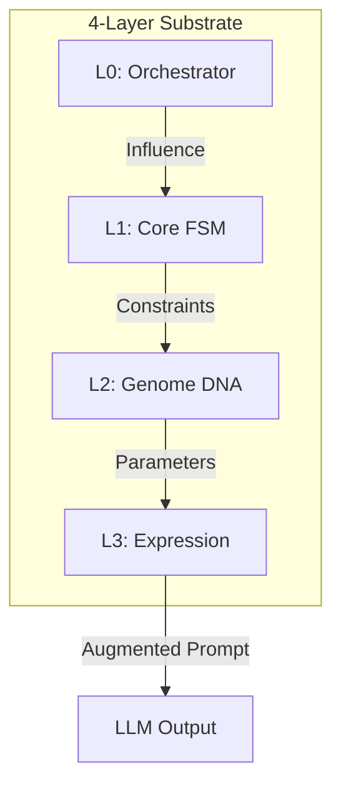

# 🧠 Persona Engine (GECCE-Substrate)

[**中文档**](./docs/README_CN.md) | [**English Guide**](./docs/HOW_TO_USE.md) | [**Architecture**](./docs/DIAGRAMS.md)

> **"Beyond static prompts: Implementing a 4-Layer Dynamic Persona Substrate for LLMs."**

Persona Engine is a high-performance framework built on the **GECCE Kernel**. It replaces static "System Prompts" with a dynamic 4-layer architecture (Engine, Core, Genome, Expression), enabling **Stochastic Sampling**, **Scenario-Aware Degradation**, and **Deterministic Evolution**.

---

## 🇨🇳 中文文档 (Chinese Documentation)
针对中文用户，我们提供了完整的中文文档库：
👉 **[点击进入中文文档中心 | Chinese Documentation Center](./docs/README_CN.md)**

---

## 🏗️ 4-Layer Architecture (GECCE-Powered)

This project is built upon the **GECCE Kernel**, a proprietary event-driven micro-kernel substrate. GECCE provides the underlying orchestration (Layer 0), while the Persona Engine implements the personality logic (L1-L3).

### The Role of GECCE
- **Event Bus**: Manages asynchronous communication between persona layers.
- **Module Substrate**: Provides the `BaseFeatureModule` and registration system.
- **Traceability**: Ensures every personality sampling event is logged and auditable at the kernel level.

---

## 🏛️ Layer Specifications
This project follows the strict specifications outlined in **[ARCHITECTURE.md](./ARCHITECTURE.md)**:

4.  **L3: Expression** - Seeded sampling and Prompt Augmentation.

👉 **[How to Use: Integrating Persona Engine](./docs/HOW_TO_USE.md)**


👉 **[For detailed technical diagrams and logic flows, click here.](./docs/DIAGRAMS.md)**

---

## 🚀 Key Features
- **Kernel-Driven**: Built on GECCE Event Bus for 100% traceability.
- **Truth Independence**: Physical separation of persona and factual logic.
- **DNA Dashboard**: A high-tech interactive UI to observe "Personality Fingerprints".
- **Asset Migration**: Persona states can be snapshotted, exported, and rolled back.

---

## ⚡ Quick Start

### 1. Environment Setup
```bash
python3 -m venv .venv
source .venv/bin/activate
pip install -r requirements.txt
```

### 2. Run Kernel Demo
Verify the coordination of all 4 layers on the GECCE substrate:
```bash
export PYTHONPATH=$PYTHONPATH:$(pwd)/src:$(pwd)/gecce_kernel_pkg
python3 src/main_kernel_demo.py
```

### 3. Launch Dashboard
Visualize the live "Personality DNA":
```bash
cd dashboard && npm run dev
```

---

## ⚖️ Ethics & License
- **Ethics Statement**: See **[ETHICS.md](./docs/ETHICS.md)** for our approach to safe AI personality simulation.
- **License**: This project is licensed under the **MIT License** - see the **[LICENSE](./LICENSE)** file for details.

---

## 🤝 Contributing
Contributions are welcome! Please read **[CONTRIBUTING.md](./CONTRIBUTING.md)** for details on our code of conduct and the process for submitting pull requests.

---

---

## 📅 Roadmap
Project milestones and current status: **[ROADMAP.md](./ROADMAP.md)**

---

*“Personality is no longer a collection of adjectives, but a computable, observable stream of probability.”*
