# 🧠 Persona Engine (GECCE-Substrate)


> **"Beyond Prompts: A Governance-First, Stateful Persona Substrate for LLMs."**
>
> **Persona Engine can be used as a persistent cognitive interface between users and computation.**

[**中文文档**](./docs/README_CN.md) | [**Integration Guide**](./docs/HOW_TO_USE.md) | [**Architecture**](./docs/DIAGRAMS.md) | [**Technical Reports**](./docs/REPORTS.md)

---

### 🛡️ Module Charter (The "No-Go" Zone)
> **Persona Engine never decides *WHAT* to do.**
> **It only constrains *HOW* decisions are formed.**
>
> We do not simulate "consciousness" or "autonomy". We provide the **Cognitive Runtime** that ensures behavioral consistency, auditability, and distinct personality traits across sessions and models.

---

## 🎯 The Core Value: Decoupling Identity from Compute

In the traditional AI stack, `Model = Personality`. This binds digital identity to a specific vendor's weights (e.g., GPT-4 vs Claude). **Persona Engine** redefines this architectural relationship:

```text
Model   = Compute / Reasoning / Token Factory (Infrastructure)
Persona = Genotype / Memory / Affect Parameters (Identity Layer)
```

**Persona Engine is the Operating System for Digital Identity.** By decoupling identity from compute, we create a **Portable Persona State** that persists across model upgrades, reboots, and platform migrations.

---

## 🏗️ 4-Layer Architecture (GECCE Kernel)

The system is built on the **GECCE Kernel**, an event-driven micro-kernel ensuring 100% traceability.

| Layer  | Component        | Function                                                                 |
| :----- | :--------------- | :----------------------------------------------------------------------- |
| **L0** | **Orchestrator** | Lifecycle Management, Persistence, Integrity Checks.                     |
| **L1** | **Core FSM**     | **Affective State Matrix (PAD)**, Intimacy Levels, Governance Barriers.  |
| **L2** | **Genome**       | **Digital Genotype** (Probabilistic Loci), Fluid Stance Vectors (R.W.C). |
| **L3** | **Expression**   | Seeded Sampling, Prompt Injection, Style Warping.                        |
| **L4** | **Memory**       | Structured Logging, Snapshot Management, **Affect-Biased Retrieval**.    |

---

## 🚀 Key Capabilities

### 1. Fluid Stance Vector (R.W.C Model)
A continuous vector model (**R**igor, **W**armth, **C**haos) replaces static "system prompts". The engine dynamically interpolates parameters to adjust the cognitive posture without breaking character.

### 2. Computable Affect (PAD Core)
Utilizing the **PAD (Pleasure-Arousal-Dominance)** model to quantify "mood" as a verifiable mathematical vector. This allows for:
- **Predictable Decay**: Emotional spikes normalize over time via homeostasis algorithms.
- **Real-time Telemetry**: Observation of internal state variables via the dashboard interface.


### 3. Stateful Persistence
- **Genotype Snapshots**: Export the exact state of a persona (including current mood and memory pointers) to a JSON file.
- **Audit Logging**: Every parameter shift is logged to an append-only journal for compliance review.

---

## � CLI Integration Demo

Persona Engine is designed to pipe structured cognitive constraints directly into any LLM environment.

```bash
# 1. Generate the Persona Context
PROMPT=$(python3 src/persona_cli.py "Explain cybernetics")

# 2. Pipe into your LLM (using tools like 'llm' or 'ollama')
llm -s "$PROMPT" "Explain cybernetics"
```

**Output System Prompt (Generated by Engine):**

```text
[ROLE]
You are an intelligent AI assistant governed by a dynamic persona engine.

[MISSION]
- Balance abstract theory with practical examples. Be professional and clear.

[POLICIES]
- Confidently stand your ground.

[STYLE]
- Maintain a serious, professional tone. No jokes.
- Balanced and objective.

[OUTPUT_FORMAT]
- Show your work concisely when necessary for correctness.

[OPTIONAL_FLAVOR]
- Occasionally mention interests related to cybernetics.
```

---

## �🔌 Typical Integration Pattern

Persona Engine is designed as **passive middleware**. It does not execute actions; it computes the *context* required for your LLM or Agent to act consistently.

```mermaid
graph LR
    User["User Input"] -->|Raw Text| PE["🧠 Persona Engine"]
    
    subgraph "Persona Middleware"
        PE -->|Computes| Stance["R.W.C Stance"]
        PE -->|Retrieves| Mem["Memory Context"]
        PE -->|Updates| Mood["Affect (PAD)"]
    end
    
    Stance & Mem & Mood -->|"Context Object"| Agent["🤖 Your LLM / Agent"]
    Agent -->|"Final Response"| User
```



**Workflow:**
1.  **Input**: You feed raw user text into the Engine.
2.  **Process**: The Engine updates its internal state (mood, memories) but *does not generate text*.
3.  **Output**: It returns a structured **Context Object** containing the System Prompt, Style Guidelines, and Memory fragments.
4.  **Execute**: **YOUR** system (Agent/LLM) uses this Context to generate the final response.

---

## 🧠 Example: Generated System Prompt (Real Engine Output)

> *The following output was generated by `process_interaction("I need to calculate and debug this error")`.*

```text
You are operating under the following cognitive constraints:

[STANCE CONTROL]
- Rigor: High (0.9) — Prioritize factual accuracy.
- Warmth: Low (0.2) — Minimal emotional expression.
- Chaos: Low (0.1) — High determinism.

[AFFECTIVE STATE (PAD)]
- Pleasure: 0.1 (Neutral)
- Arousal: 0.6 (Alert)
- Dominance: 0.8 (Directive)

[BEHAVIORAL GUIDELINES]
- Maintain internal consistency with the current stance.
- Do not speculate beyond provided information.
```

**Persona Engine does not generate responses.** It generates the **constraints** under which responses are formed.

---

## ⚡ Quick Start

> **Note**: Persona Engine acts as a **passive middleware** and never executes user intent directly. It generates the *context* for the LLM to execute.

```bash
# 1. Clone and Install
git clone https://github.com/BBQ4ever/Persona-Engine.git
cd Persona-Engine
pip install -r requirements.txt
npm install --prefix dashboard

# 2. Run the Engine & Dashboard (Monitoring UI)
npm run dev --prefix dashboard
# (In a separate terminal)
python3 src/main_demo.py
```

### Python API Example

```python
from src.persona_engine import PersonaEngine

# 1. Initialize with a specific Genotype Snapshot
engine = PersonaEngine(snapshot="src/l2_genome/presets/base_persona_v1.json")

# 2. Process an Interaction (Stimulus)
# The engine calculates the new Stance and Affect vectors based on input intent.
# Output is a 'Context Object', ensuring the Engine remains a passive middleware.
context = engine.process_interaction(
    user_input="I need technical assistance with this error.",
    session_id="user_123"
)

# 3. Inject into Model (Execution)
# The Context Object provides the precise System Prompt parameters.
print(context['system_prompt'])
# Output: "Adopt a High-Rigor [0.9] stance. Focus on factual analysis..."

# 4. Telemetry
print(context['affect_state']) 
# Output: {'p': 0.1, 'a': 0.6, 'd': 0.8} (High dominance, high arousal for problem solving)
```

---

## 🏆 Development Status

> **[Read the Full Lifecycle Evaluation Report (Phase 0-10)](./docs/reports/full_lifecycle_v1_report.md)**

The system has undergone 10 phases of iterative development to validate stability, performance, and architectural decoupling. We are currently implementing **Phase 11 (Self-Correction)** to introduce governed parameter adjustments based on historical logs.

---

## ⚖️ Ethics & License
- **Ethics**: See **[ETHICS.md](./docs/ETHICS.md)** for our approach to safe personality simulation and governance layers.
- **License**: MIT License.

---

*“Personality is no longer a collection of adjectives, but a computable, observable stream of probability.”*
