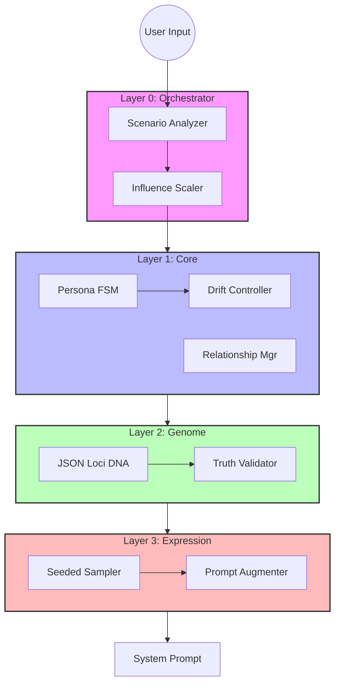
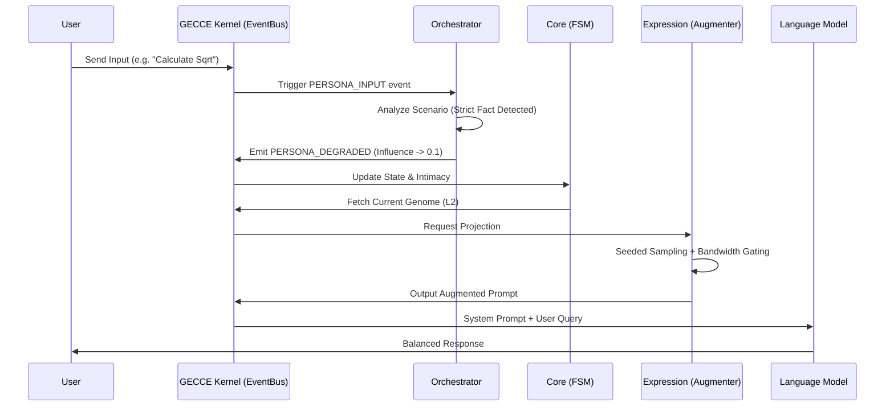
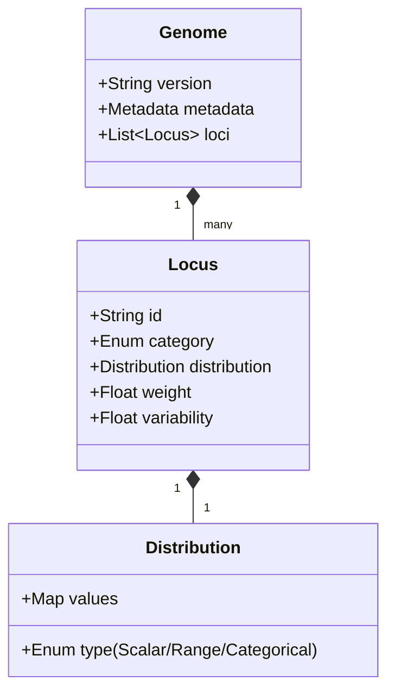
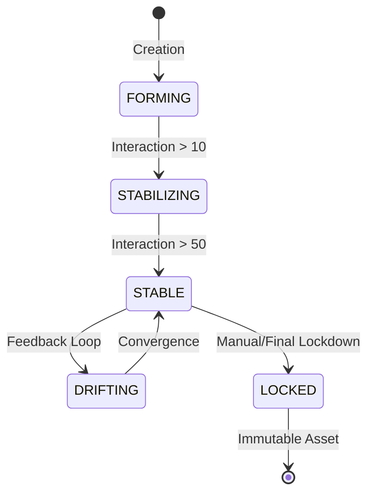

# 📊 Persona Engine: Technical Diagrams

This document provides a visual representation of the Persona Engine's architecture, data flows, and logic systems using Mermaid diagrams.

---

## 1. 🏛️ Layered Architecture (L0-L3)
The system is built on a 4-layer substrate, governed by the GECCE Kernel.

---

## 2. 🔄 Sequence Diagram: Interaction Loop
How an event travels through the kernel substrate.

---

## 3. 🧬 Data Model: Genome DNA Entity
Structural definition of a Trait Locus.

---

## 4. 📈 Persona Lifecycle (FSM)
The evolution path of a single persona entity.

---

## 🌐 Navigation
- [Back to README](../README.md)
- [Architecture Details](./zh/architecture_cn.md)
