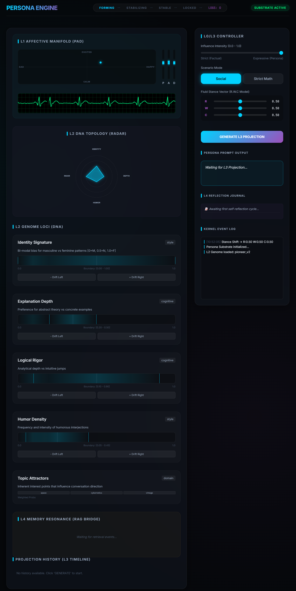
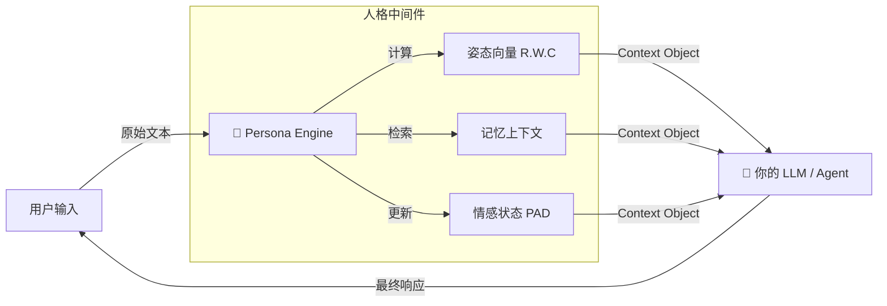

# 🧠 Persona Engine (GECCE-Substrate)


> **"不仅仅是提示词：面向大模型的治理优先、有状态人格基质。"**

[**English Guide**](../README.md) | [**集成指南**](./HOW_TO_USE.md) | [**架构图解**](./DIAGRAMS.md) | [**技术报告中心**](./REPORTS.md)

---

### 🛡️ 核心宪章 (Module Charter / No-Go Zone)
> **Persona Engine 从不决定 *做什么 (WHAT)*。**
> **它只约束决策 *如何形成 (HOW)*。**
>
> 我们不模拟“意识”或“自主性”。我们提供的是**认知运行时 (Cognitive Runtime)**，用于确保在不同会话和模型之间保持行为的一致性、可审计性和独特的人格特征。

---

## 🎯 核心价值：身份与算力的解耦 (Decoupling Identity from Compute)

在传统的 AI 技术栈中，`模型 = 人格`。这意味着你的数字身份被绑定在特定厂商的权重文件上（例如 GPT-4 或 Claude）。**Persona Engine** 重新定义了这种架构关系：

```text
模型 (Model)   = 计算 / 推理 / Token 工厂 (基础设施)
人格 (Persona) = 基因型 / 记忆 / 情感参数 (身份层)
```

**Persona Engine 是数字身份的操作系统。** 通过将身份与算力解耦，我们创建了一个**可移植的人格状态 (Portable Persona State)**，它可以在模型升级、系统重启和平台迁移中保持存续。

---

## 🏗️ 4 层架构 (GECCE Kernel)

系统基于 **GECCE 内核** 构建，这是一个事件驱动的微内核，确保 100% 的可追溯性。

| 层级   | 组件             | 功能                                              |
| :----- | :--------------- | :------------------------------------------------ |
| **L0** | **Orchestrator** | 生命周期管理，持久化，完整性检查。                |
| **L1** | **Core FSM**     | **情感状态矩阵 (PAD)**，亲密度等级，治理护栏。    |
| **L2** | **Genome**       | **数字基因型** (概率位点)，流体姿态向量 (R.W.C)。 |
| **L3** | **Expression**   | 种子采样，提示词注入，风格扭曲。                  |
| **L4** | **Memory**       | 结构化日志，快照管理，**情感偏置检索**。          |

---

## 🚀 关键能力

### 1. 流体姿态向量 (R.W.C Model)
使用连续向量模型 (**R**igor 严谨, **W**armth 温暖, **C**haos 混乱) 取代静态的“系统提示词”。引擎动态插值参数以调整认知姿态，而不会破坏角色的一致性。

### 2. 可计算情感 (PAD Core)
利用 **PAD (愉悦-唤醒-支配)** 模型将“情绪”量化为可验证的数学向量。这实现了：
- **可预测衰减**: 情感波动通过稳态算法随时间归一化。
- **实时遥测**: 通过仪表盘接口实时观测内部状态变量。



### 3. 有状态持久化 (Stateful Persistence)
- **基因型快照**: 将人格的确切状态（包括当前情绪和记忆指针）导出为 JSON 文件。
- **审计日志**: 每一个参数的变动都被记录在只能追加的日志中，以供合规审查。

---

## 💻 命令行集成演示 (CLI Integration Demo)

Persona Engine 旨在将结构化的认知约束直接传输到任何 LLM 环境中。

```bash
# 1. 生成人格上下文
PROMPT=$(python3 src/persona_cli.py "Explain cybernetics")

# 2. 注入你的 LLM (使用 'llm' 或 'ollama' 等工具)
llm -s "$PROMPT" "Explain cybernetics"
```

**输出的系统提示词 (由引擎生成):**

```text
[ROLE]
You are an intelligent AI assistant governed by a dynamic persona engine.

[MISSION]
- Balance abstract theory with practical examples. Be professional and clear.

[POLICIES]
- Confidently stand your ground.

[STYLE]
- Maintain a serious, professional tone. No jokes.
- Balanced and objective.

[OUTPUT_FORMAT]
- Show your work concisely when necessary for correctness.

[OPTIONAL_FLAVOR]
- Occasionally mention interests related to cybernetics.
```

---

## 🔌 典型集成模式 (Integration Pattern)

Persona Engine 被设计为**被动中间件**。它不执行动作；它只计算你的 LLM 或 Agent 保持一致性所需的*上下文*。



**工作流:**
1.  **输入**: 你将原始用户文本输入给引擎。
2.  **处理**: 引擎更新其内部状态（心情、记忆），但*不生成回复文本*。
3.  **输出**: 它返回一个结构化的 **上下文对象 (Context Object)**，包含系统提示词、风格指南和记忆片段。
4.  **执行**: **你的**系统（Agent/LLM）使用此上下文来生成最终响应。

---

## 🧠 示例：生成的系统提示词 (引擎实机输出)

> *以下输出由 `process_interaction("我需要计算并解决这个错误")` 生成。*

```text
你当前需要在以下认知约束下运行：

[姿态控制 (STANCE)]
- 严谨度 (Rigor): 高 (0.9) — 优先考虑事实准确性。
- 温暖度 (Warmth): 低 (0.2) — 极少的情感表达。
- 混沌度 (Chaos): 低 (0.1) — 高确定性。

[情感状态 (PAD)]
- 愉悦度 (Pleasure): 0.1 (中性)
- 唤醒度 (Arousal): 0.6 (警觉)
- 支配度 (Dominance): 0.8 (指令性)

[行为准则]
- 保持与当前姿态的内在一致性。
- 不要对未提供的信息进行猜测。
```

**Persona Engine 不生成最终回复。** 它生成的是回复形成过程中的**约束条件**。

---

## ⚡ 快速开始

> **注意**: Persona Engine 作为一个**被动中间件**运行，从不直接执行用户意图。它仅生成用于 LLM 执行的*上下文*。

```bash
# 1. 克隆并安装
git clone https://github.com/BBQ4ever/Persona-Engine.git
cd Persona-Engine
pip install -r requirements.txt
npm install --prefix dashboard

# 2. 启动引擎与仪表盘 (监控 UI)
npm run dev --prefix dashboard
# (在另一个终端窗口中)
python3 src/main_demo.py
```

### Python API 示例

```python
from src.persona_engine import PersonaEngine

# 1. 使用特定的基因型快照进行初始化
engine = PersonaEngine(snapshot="src/l2_genome/presets/base_persona_v1.json")

# 2. 处理交互 (刺激)
# 引擎基于输入意图计算新的姿态和情感向量。
# 输出是一个 'Context Object'，确保引擎保持作为被动的中间件。
context = engine.process_interaction(
    user_input="我需要关于此错误的技术支持。",
    session_id="user_123"
)

# 3. 注入模型 (执行)
# Context Object 提供了精确的 System Prompt 参数。
print(context['system_prompt'])
# 输出: "采用高严谨 [0.9] 姿态。专注于事实分析..."

# 4. 遥测
print(context['affect_state']) 
# 输出: {'p': 0.1, 'a': 0.6, 'd': 0.8} (高支配性，高唤醒度以解决问题)
```

---

## 🏆 开发状态

> **[阅读全周期演进评估报告 (Phase 0-10)](./reports/zh/full_lifecycle_v1_report_cn.md)**

系统已历经 10 个阶段的迭代开发，验证了稳定性、性能和架构解耦的可行性。我们目前正在实施 **Phase 11 (自我修正)**，引入基于历史日志的受控参数调整。

---

## ⚖️ 伦理与许可
- **伦理**: 详见 **[ETHICS.md](./ETHICS.md)**，了解我们关于安全人格模拟和治理层的方案。
- **许可**: MIT License。

---

*“人格不再是一堆形容词，而是一股可计算、可观测的概率流。”*
