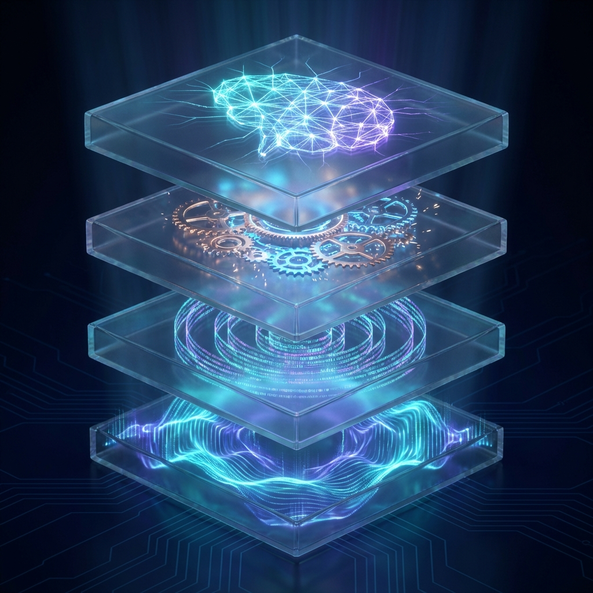

# 人格引擎 (Persona Engine) - 中文文档中心

欢迎来到 Persona Engine 的中文文档库。本项目旨在为大语言模型（LLM）提供一套可计算、可观测且动态演化的人格基座。

---

## 📚 文档列表

### 1. 核心指南
- **[系统使用指南](./zh/usage_cn.md)**: 如何将引擎接入您的应用（Python 示例）。
- **[系统开发报告中心](./REPORTS.md)**: 包含 Phase 0 - Phase 5 的详细技术总结。
- **[系统架构描述](./zh/architecture_cn.md)**: 深入理解 L0-L3 四层结构的协作逻辑。

---

## 🏗️ 架构基座：GECCE Kernel
本项目运行在 **GECCE (Generic Event-driven Core Component Engine)** 底层微内核之上。

- **内核作用**：GECCE 提供了底层的事件总线（Event Bus）和模块注册机制。
- **协同逻辑**：L0 调度层直接与 GECCE 内核桥接，将外界输入转化为内核事件，驱动 L1-L3 进行人格计算。
- **[技术图谱与逻辑流](./DIAGRAMS.md)**: 包含 Mermaid 渲染的架构图、序列图与状态机。
- **[实施路线图](./zh/roadmap_cn.md)**: 项目的分阶段开发计划与目前的达成度。
- **[L2 基因章程](./zh/genome_charter_cn.md)**: 定义 AI 性格位点的伦理与技术边界。

### 2. 未来演进
- **[未来演化与价值主张](./zh/evolution_cn.md)**: 记录关于“人格回退”、“人格迁移”等高价值设计的灵感库。

### 3. 合规与社区
- **[伦理与安全声明](./ETHICS.md)**: 关于 AI 人格模拟的伦理边界。
- **[贡献指南](../CONTRIBUTING.md)**: 如何参与本项目。

---

## 🚀 快速导航
- **[返回英文主页](../README.md)**
- **[查看代码集成示例](../src/app_integration.py)**
- **[启动可视化仪表盘](../dashboard/index.html)**

---

> *“性格不再是一堆形容词的堆砌，而是可计算、可观测的概率流。”*
