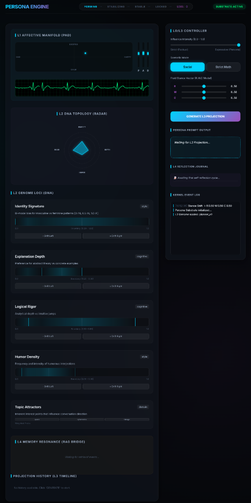

# Persona Engine Technical Report - Phase 10: Multi-Session Coherence & Persistence

## 1. Phase Objective
The objective of Phase 10 was to provide the Persona Engine with "long-term temporal stability" and "contextual memory." This involves persisting the AI's internal state across sessions, biasing its memory retrieval based on its current mood, and maintaining a chronological log of its behavioral evolution.

## 2. Core Implementations

### 2.1 Universal Snapshot Persistence (`SnapshotManager`)
We implemented a robust snapshot system that serializes the entire core state:
- **State Capture**: Saves the `PersonaFSM` (interaction counts, intimacy levels, state transitions) and the `AffectiveManifold` (current PAD values and personality baselines).
- **Robust Parsing**: Implemented regex-based filename parsing to support complex, multi-word labels (e.g., `snapshot_stress_test_v10_final.json`).
- **Auto-Recovery**: Support for automatically loading the most recent snapshot upon initialization.

### 2.2 Affective Memory Salience Bridge (`MemorySalienceBridge`)
This module creates a psychological link between the AI's current "mood" and its "memory":
- **Mood-Biased Filtering**: Generates metadata filters for RAG systems. For example, if the AI is in a "Melancholic" state (Low Pleasure), it biases retrieval toward similar emotional contexts.
- **Arousal-Driven Breadth**: The `top_k_multiplier` dynamically expands the search breadth when the AI is highly "Aroused" (Excited/Stressed), simulating a rush of memories or increased cognitive activity.

### 2.3 Recursive Self-Observation Journal (`PersonaReflectionJournal`)
To support future meta-cognitive features, we implemented a structured behavior log:
- **JSONL Format**: High-performance append-only logging of every interaction status.
- **Memory-Efficient Tail Reading**: Implemented a specialized "tail" reader that reads the last few entries from the end of the file. This ensures O(1) memory usage regardless of whether the log is 1MB or 1GB.

### 2.4 Visualization: Memory Resonance & Journaling
- **Memory Bubbles**: Visualized the LTM retrieval as "Resonance Bubbles." Golden bubbles indicate standard retrieval, while **Glowing Blue bubbles** indicate emotional resonance triggered by the AI's current affective state.
- **Reflection Journal UI**: Integrated a live journal feed into the dashboard, showing the AI's meta-cognitive observations (e.g., "Observing drift... Current affect is positive.").

### 2.5 Bio-Sensory UI: Affective Homeostasis
The **L1 Affective Manifold** visualization now reflects "living" behaviors:
- **Pulse & Decay**: Emotional impacts from interactions (Pulse) are now followed by a gradual return to the baseline (Decay).
- **Autonomous Movement**: The "Mood Dot" moves autonomously as the AI performs internal homeostasis, creating a sense of a living persona.

## 3. Technical Insight: Personality as a Continuous Narrative
With Phase 10, the AI is no longer a "one-off" process. It now has a "life story" (the Journal) and "persistence" (Snapshots). The visualization of homeostasis and memory resonance bridges the gap between cold algorithms and believable simulated life.

## 4. Deliverables
- `src/l0_orchestrator/persistence.py`: Snapshot logic with regex-based parsing.
- `src/l3_expression/memory_bridge.py`: Affective-to-RAG metadata mapping.
- `src/l4_memory/journal.py`: High-performance behavioral logging.
- `tests/test_phase_10_full.py`: Comprehensive validation suite.

## 5. Next Step Preview: Phase 11 - Meta-Cognitive Self-Correction
We will leverage the Reflection Journal to allow the AI to perform "Offline Reflection," analyzing its own behavioral logs to adjust its own DNA variability or propose Governance Charter updates.
